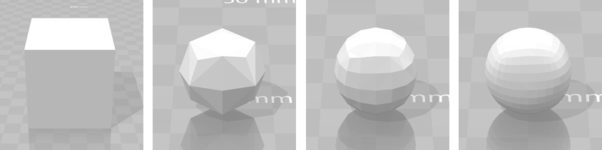

Catmull Clark subdivision algorithm by g.koutaki 2018.3.15

[References] 
-https://rosettacode.org/wiki/Catmull%E2%80%93Clark_subdivision_surface 
-http://web.cse.ohio-state.edu/~dey.8/course/784/note20.pdf 

[USAGE]

$subdiv in.obj out.obj [K=1 ftriangle=1]

-in.obj: input wavefront obje file 
-K: number of iterations 
-ftriangle: 1 = convert output obj to triangle mesh 

